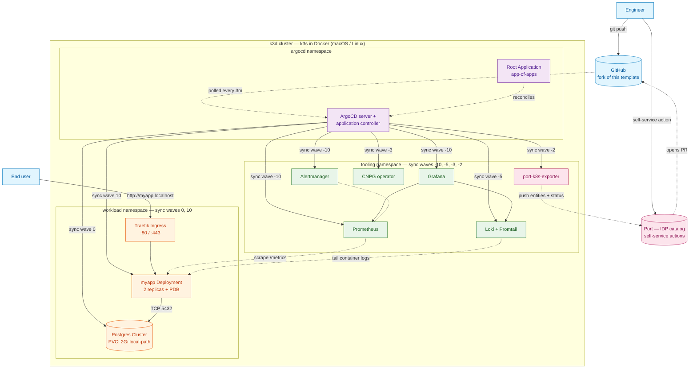
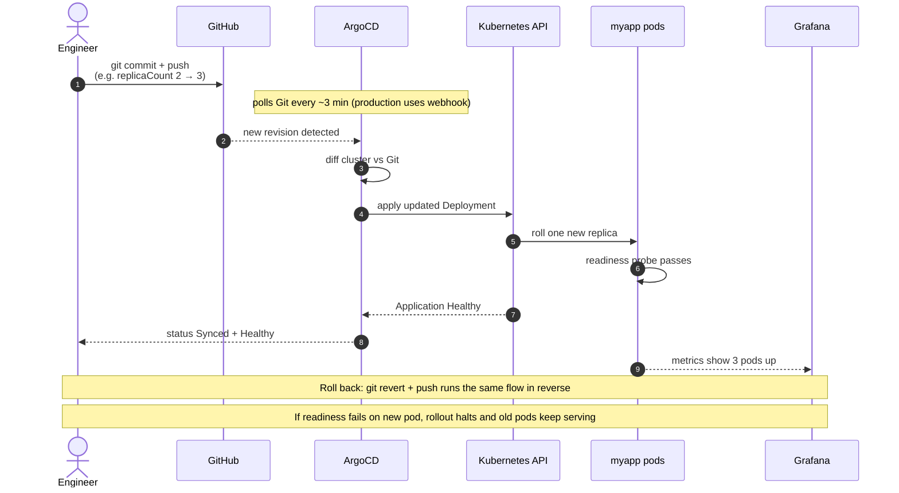

# k3d + ArgoCD local development template

A complete local Kubernetes development environment with GitOps, observability, an Internal Developer Platform, and a stateful example workload. Bootstrap a k3d cluster, get full LGTM observability, a CloudNativePG-managed Postgres, a Port (IDP) catalog with self-service actions, and a sample Go service — all reconciled from Git by ArgoCD.

Designed to be forked as a starting point for your own GitOps projects, or used as a reference for the patterns it demonstrates.

## What you get

- **k3d cluster** — k3s running in Docker; works identically on macOS (Apple Silicon included) and Linux.
- **ArgoCD** — reconciles everything else from Git via the app-of-apps pattern.
- **LGTM observability stack** — Loki, Grafana, Tempo-style metric scraping via Prometheus, Mimir-equivalent storage (in-cluster Prometheus), Alertmanager — courtesy of `kube-prometheus-stack` + Loki + Promtail.
- **CloudNativePG** — operator-managed Postgres with native HA, replication, and Prometheus integration.
- **Port (IDP) layer** — the developer-facing pane: a catalog populated from live cluster state, self-service actions (bump tag, scaffold service, rollback) that all open PRs, and a production-readiness scorecard wired to what the chart actually templates. Optional, env-gated.
- **Example Go workload (`myapp`)** — production-shaped Go service with `/healthz`, `/readyz`, `/metrics`, structured logging, graceful shutdown, and a CRUD API backed by Postgres.
- **Helm chart** — full template with Deployment, Service, Ingress, ServiceMonitor, PrometheusRule, PDB, and an auto-loaded Grafana dashboard ConfigMap.
- **CI/CD workflows** — GitHub Actions for Go test + chart lint + image build, semver-tag-driven releases, ArgoCD diff previews on PRs, and Port-driven self-service flows.

## Prerequisites

- **Docker** (Docker Desktop on macOS, docker-engine on Linux)
- **`kubectl`**, **`make`**, **`git`**
- **`k3d`** (auto-installed if missing; `brew install k3d` or `curl https://raw.githubusercontent.com/k3d-io/k3d/main/install.sh | bash`)

Tested on macOS (Apple Silicon) and Linux (Ubuntu, Pop!\_OS).

## Quick start

```bash
make bootstrap         # k3d cluster + ArgoCD + root Application
make argocd-ui         # in another terminal — open https://localhost:8080
make argocd-password   # initial admin password
```

Within ~3 minutes (or ~30 seconds with the image cache warmed), ArgoCD reconciles the full stack:
- LGTM observability stack (Prometheus, Grafana, Loki, Alertmanager)
- CloudNativePG operator + a single-instance Postgres cluster
- A Go service exposed at `http://myapp.localhost`

A pre-built Grafana dashboard auto-loads at `http://grafana.localhost`.

If you fork this repo as **private**, set `GITHUB_PAT` before `make bootstrap` so ArgoCD can fetch your fork:

```bash
export GITHUB_PAT=ghp_xxxxxxxxxxxxxxxxxxxxxxxxxxxxx   # PAT with Contents: Read-only
make bootstrap
```

Public forks don't need a PAT — ArgoCD fetches anonymously.

To light up the **Port (IDP) layer**, set Port API credentials (free org at [getport.io](https://www.getport.io/)) and run `port-bootstrap` after the cluster is up:

```bash
export PORT_CLIENT_ID=...
export PORT_CLIENT_SECRET=...
make port-bootstrap   # pushes blueprints/actions/scorecards + creates in-cluster Secret
```

If those env vars aren't set, the rest of the stack still bootstraps cleanly — the Port layer is fully optional.

---

## Architecture



### How a Git change converges to the cluster



---

## What's deployed and why

| Component | Purpose | Notes |
|---|---|---|
| **k3d** (k3s in Docker) | Local Kubernetes | k3s is the engine; k3d wraps it in Docker so the same setup runs identically on macOS (Apple Silicon included) and Linux. Cluster shape lives in `bootstrap/k3d-config.yaml`. Alternatives: kind, minikube, microk8s. |
| **ArgoCD** | GitOps controller | Reconciles cluster state from Git. App-of-apps pattern means only one manifest is applied imperatively at bootstrap. Alternative: Flux (more modular, similar capability). |
| **kube-prometheus-stack** | Prometheus, Grafana, Alertmanager, exporters | One chart for the whole observability foundation. ServiceMonitor and PrometheusRule CRDs let workloads self-register their scrape and alert configs. |
| **Loki + Promtail** | Log aggregation | Loki for storage and query, Promtail as a DaemonSet shipping container logs. Single-binary mode for local; production deployments split into distributor / ingester / querier + object storage. |
| **CloudNativePG** | Operator-managed Postgres | The `Cluster` CRD reconciles to a StatefulSet with PVCs, services, and auto-generated app credentials (`postgres-app` Secret containing a ready-to-use `uri`). Native HA available by bumping `instances: 1 → 3`. Alternative: Crunchy Postgres Operator, the Bitnami Helm chart. |
| **Port (IDP)** | Developer-facing catalog + self-service | Pulls live state from the cluster (via `port-k8s-exporter`) and exposes a UI for browsing services, scorecards, and self-service actions. Actions never touch the cluster directly — they open PRs against this repo, so the GitOps loop stays the single source of change. Blueprints / actions / scorecards live as JSON IaC under `port/`. Alternatives: Backstage (heavier, self-hosted), CNOE, OpsLevel, Cortex. |
| **myapp (Go)** | Example workload | Small CRUD service over Postgres, exposing `/healthz`, `/readyz`, `/metrics`. Designed as a starting template for your own workloads. |
| **Helm** | Chart templating | Used here for the local `myapp` chart and for sourcing upstream charts. Alternative: Kustomize for overlays. |
| **Traefik** (k3s default) | Ingress controller | Bundled with k3s, no extra setup. Production alternatives: NGINX Ingress, Envoy Gateway, Istio Gateway. |

---

## Repository layout

```
.
├── README.md
├── Makefile                       # bootstrap entry point + dev-loop targets
├── .github/workflows/
│   ├── build.yml                  # CI on PRs + main: lint, test, build, push image
│   ├── release.yml                # on v*.*.* tags: build semver image set + GitHub Release
│   └── argocd-diff-preview.yml    # PR-time render+diff of ArgoCD-managed manifests
├── bootstrap/
│   ├── 00-cluster-create.sh       # creates the k3d cluster (idempotent)
│   ├── k3d-config.yaml            # versioned cluster shape
│   ├── images.txt                 # cached image list (see "Image cache")
│   └── argocd/
│       ├── namespace.yaml
│       └── root-app.yaml          # app-of-apps root Application
├── apps/                          # ArgoCD Applications, discovered recursively
│   ├── tooling/
│   │   ├── kube-prometheus-stack.yaml
│   │   ├── loki.yaml
│   │   ├── cnpg-operator.yaml
│   │   └── port-k8s-exporter.yaml # IDP: pushes cluster state to Port
│   └── workload/
│       ├── postgres.yaml          # ArgoCD Application -> manifests/postgres/
│       └── myapp.yaml
├── manifests/
│   └── postgres/
│       └── cluster.yaml           # CloudNativePG Cluster CR
├── charts/
│   └── myapp/                     # local Helm chart for myapp
│       ├── Chart.yaml
│       ├── values.yaml
│       └── templates/
├── port/                          # IDP-as-code (Port blueprints, actions, scorecards)
│   ├── blueprints/                #   entity schemas (Service, RunningService, ...)
│   ├── actions/                   #   self-service buttons (bump-tag, scaffold, rollback)
│   ├── scorecards/                #   production-readiness quality gates
│   ├── mapping/                   #   cluster → catalog JQ (canonical copy)
│   └── README.md
└── app/                           # Go service source code
    ├── main.go
    ├── go.mod
    ├── Dockerfile
    └── migrations/
        └── 001_init.sql
```

The **app-of-apps** pattern means only one manifest (`bootstrap/argocd/root-app.yaml`) is applied imperatively. Everything else is reconciled from Git.

**Sync waves** ensure ordering:

| Wave | Application | Reason |
|---|---|---|
| `-10` | `kube-prometheus-stack` | ServiceMonitor + PrometheusRule CRDs must exist first |
| `-5` | `loki` | Independent observability component |
| `-3` | `cnpg-operator` | Postgres `Cluster` CRD must exist before workload sync |
| `-2` | `port-k8s-exporter` | Bridges cluster state to the IDP catalog; needs ServiceMonitor + Application CRDs (provided by earlier waves) |
| `0` | `postgres` | The CloudNativePG Cluster CR |
| `10` | `myapp` | Depends on Postgres being ready |

---

## How to verify

After `make bootstrap`:

```bash
# Cluster up
kubectl get nodes

# All Applications synced and healthy
kubectl get applications -n argocd

# Pods up across namespaces
kubectl get pods -A

# myapp reachable
curl -s http://myapp.localhost/healthz
curl -s http://myapp.localhost/readyz
curl -s http://myapp.localhost/metrics | head -20

# Create an item
curl -X POST http://myapp.localhost/items \
  -H 'Content-Type: application/json' \
  -d '{"name":"test"}'

# List items
curl http://myapp.localhost/items
```

If `myapp.localhost` doesn't resolve, add it to `/etc/hosts`:

```
127.0.0.1   myapp.localhost grafana.localhost
```

---

## Operability signals

The example service demonstrates the operability patterns an SRE expects:

- **Health:** `/healthz` (liveness — always 200 if process alive), `/readyz` (readiness — 200 only when DB is reachable)
- **Metrics:** Prometheus exporter on `/metrics` — request count, request duration, DB connection pool, build info
- **Logs:** stdout JSON, shipped to Loki by Promtail
- **Dashboard:** auto-loaded into Grafana from a ConfigMap in the myapp chart
- **Alerts:** Prometheus rules for `MyappDown` and `MyappHighErrorRate`, fired via Alertmanager

---

## How to demo a rollout

1. Visit `http://myapp.localhost` and `http://grafana.localhost` — confirm both healthy
2. Edit `charts/myapp/values.yaml` — change `replicaCount: 2 → 3`
3. `git commit && git push`
4. Watch the ArgoCD UI — within ~3 minutes the Application reconciles (or `argocd app sync myapp` to force immediately)
5. Confirm via `kubectl get pods -n workload` that the new replica is up
6. Confirm in the Grafana dashboard that pod count increased
7. Roll back: `git revert HEAD && git push` — ArgoCD reconciles back to 2 replicas

### What happens when a change breaks

The Helm rolling update strategy is configured with `maxUnavailable: 0`, so a broken change:

1. ArgoCD applies the new Deployment spec
2. New pod fails its readiness probe
3. Kubernetes does NOT shift traffic to it (readiness gate)
4. Old pods stay healthy and serving traffic
5. The Deployment hangs in a "Progressing" state until the change is reverted

This is the simplest form of progressive delivery — no additional CRD like Argo Rollouts required. For canary or blue/green patterns with automated analysis, Argo Rollouts is the next step up.

---

## Image cache — fast bootstrap, demo-resilient

First-time `make bootstrap` is network-bound: kubelet pulls ~1 GB of images (Prometheus, Grafana, Loki, CNPG, Postgres, ArgoCD, kube-state-metrics, etc.) from upstream registries. To avoid paying that cost on every `make destroy && make bootstrap`, the build chains an image-cache step automatically.

`bootstrap/images.txt` is committed to the repo and lists the full image set the cluster needs. `make bootstrap` runs `make pre-images` after `cluster-create` and before `install-argocd`, so by the time ArgoCD starts reconciling, every image is already in the cluster's containerd cache.

### How it works

```
make bootstrap
  ├─ cluster-create      (k3d up)
  ├─ pre-images          ← imports bootstrap/images.txt into k3d
  ├─ install-argocd
  ├─ argocd-repo-creds   (only if GITHUB_PAT is set, for private forks)
  └─ bootstrap-apps      (applies root Application; ArgoCD takes over)
```

On a fresh fork, `bootstrap/images.txt` may not be present yet. `pre-images` soft-fails with a hint and bootstrap continues with normal network pulls. Once everything's healthy:

```bash
make snapshot-images        # writes bootstrap/images.txt with current cluster's image set
git add bootstrap/images.txt && git commit -m "chore: refresh image cache" && git push
```

Subsequent bootstraps then skip the network for image pulls.

---

## Local dev loop — fast iteration without the GHCR roundtrip

For local iteration on the Go service, the GHCR path (`build → push → ArgoCD pulls`) takes minutes per change. `k3d image import` skips the registry entirely:

```bash
make dev-image     # build locally + import into k3d cluster
make dev-deploy    # ↑ + auto-bump charts/myapp/values.yaml with the new tag
                   #   (commit + push to converge via GitOps)
make dev-sync      # force ArgoCD to sync myapp now (skips the ~3min poll)
```

The dev image is tagged with the same `ghcr.io/...` prefix as production, e.g. `ghcr.io/.../k3d-argocd-template-myapp:dev-abc1234`. Because the chart's `imagePullPolicy: IfNotPresent` lets kubelet use a locally-cached image when one exists at that exact tag, kubelet finds the imported image and never tries to fetch from GHCR. Same image name in dev and production, no chart toggle.

Inner-loop time: ~30 seconds from code change to running pods, vs. several minutes via GHCR.

---

## Continuous integration & versioning

Three GitHub Actions workflows in `.github/workflows/`.

### `build.yml` — runs on PRs and pushes to `main`

Three parallel jobs:

| Job | What it does |
|---|---|
| `go-test` | `go vet`, `go test -race`, `go build` against `app/` |
| `helm-lint` | `helm lint charts/myapp`, render templates, sanity-check that the expected resource kinds (Deployment, Service, Ingress, ServiceMonitor) are present |
| `docker-build` | Builds and pushes the image to GHCR. Runs **only on `main`** — PRs from forks don't get write access to the registry. Tags: `main`, `sha-<short>`. Builds for both `linux/amd64` and `linux/arm64`. Uses GHA cache for buildx layers. |

### `release.yml` — runs on semver tags (`v*.*.*`)

Triggered by pushing a tag that matches `vMAJOR.MINOR.PATCH[-PRERELEASE]`. The workflow:

1. Validates the tag is real semver — fails fast on malformed tags
2. Builds and pushes the image with a full tag set: `1.2.3`, `1.2`, `1`, `latest` (latest skipped on pre-releases)
3. Cuts a GitHub Release with auto-generated notes from PRs/commits since the previous tag

#### Cutting a release

```bash
# Bump charts/myapp/Chart.yaml `appVersion` to match (e.g. 0.2.0)
git add charts/myapp/Chart.yaml
git commit -m "chore: prepare v0.2.0"
git push

# Tag and push
git tag v0.2.0
git push origin v0.2.0
```

Because `image.tag: ""` in `values.yaml` falls back to `.Chart.AppVersion`, bumping `Chart.yaml` is the only place version changes need to live.

### `argocd-diff-preview.yml` — runs on PRs that touch GitOps paths

When a PR changes anything under `apps/`, `charts/`, or `bootstrap/argocd/`, this workflow:

1. Checks out both `main` and the PR branch
2. Runs [argocd-diff-preview](https://dag-andersen.github.io/argocd-diff-preview/) — a temporary ArgoCD inside a Docker container that renders the manifests for both branches with their full Helm dependencies resolved, then computes the diff
3. Posts the diff as a PR comment (editing in place on subsequent commits)

The output is what reviewers want to see: not a `git diff` of YAML templates, but the **resolved Kubernetes objects** that would land in the cluster if the PR merged.

---

## Port — the IDP layer that ties this together

The stack so far gives you GitOps, observability, and a real workload. What it doesn't give you is the *developer-facing pane* — a single place where someone can browse "what's running, who owns it, is it healthy, what scorecard is it on, and what can I do about it." That's what Port adds.

The design rule for this integration: **Port is a trigger layer, not a truth layer.** Every self-service action ends in a PR against this repo. Cluster mutations still flow through ArgoCD reconciliation. Git stays the only path to change.

### How it ties to the existing stack

| Existing piece | What Port reflects |
|---|---|
| ArgoCD Application status | `runningService.argocdSyncStatus`, `runningService.argocdHealth`, plus a separate `argocdApplication` entity per Application |
| Deployment in `workload` namespace | `runningService` entity with image tag, replicas, namespace, owning Service |
| ServiceMonitor / PrometheusRule / PDB / dashboard ConfigMap | Boolean scorecard properties (`hasServiceMonitor`, `hasAlerts`, `hasPDB`, `hasDashboard`) |
| `make dev-deploy` (the GitOps lever) | "Bump image tag" self-service action — opens the same `values.yaml` edit as a PR |
| `git revert` of a tag bump | "Roll back to previous tag" action, with required approval |
| New service via copying the chart | "Scaffold new service" action — clones `charts/myapp` + writes a new ArgoCD Application |

### IDP-as-code

```
port/
├── blueprints/    # the "types" — Service, RunningService, K8sCluster, ArgoCD App, Deployment
├── actions/       # the "buttons" — bump-tag, scaffold-service, rollback
├── scorecards/    # production-readiness gates wired to chart-templated resources
└── mapping/       # cluster → catalog JQ (the K8s exporter consumes this)
```

Pushed to the Port API via `make port-sync` (an idempotent `curl + jq` loop — see the Makefile). PRs against `port/` go through the same review as `apps/` or `charts/`.

### How a self-service action flows

```mermaid
sequenceDiagram
    autonumber
    actor Dev as Engineer
    participant Port as Port (IDP)
    participant GH as GitHub Actions
    participant Repo as Git repo
    participant Argo as ArgoCD
    participant K8s as Kubernetes
    participant Exp as port-k8s-exporter

    Dev->>Port: Click "Bump image tag" on myapp-k3d
    Port->>GH: workflow_dispatch port-bump-tag.yml<br/>{service, tag, port_context}
    GH->>GH: edit charts/myapp/values.yaml
    GH->>Repo: open PR (peter-evans/create-pull-request)
    GH-->>Port: PATCH_RUN status=SUCCESS, link=PR URL
    Dev->>Repo: review + merge
    Repo-->>Argo: poll (~3 min) detects new revision
    Argo->>K8s: apply updated Deployment
    K8s->>K8s: rolling update with readiness gate
    Exp-->>Port: push runningService.imageTag = <new tag><br/>argocdHealth = Healthy
    Port-->>Dev: catalog updated; scorecard re-evaluated
```

### Production-readiness scorecard

The rules in `port/scorecards/production-readiness.json` only check properties that the Helm chart already templates. That makes the scorecard a measure of **"is this service wired up the way the platform expects?"** rather than a separate compliance system.

| Level | Rule | What it checks |
|---|---|---|
| Bronze | `hasHealthz` | Liveness endpoint exposed |
| Bronze | `hasReadyz` | Readiness endpoint exposed |
| Bronze | `argocd_healthy` | Synced + Healthy in ArgoCD |
| Silver | `hasServiceMonitor` | Prometheus scrape configured |
| Silver | `hasDashboard` | Auto-loaded Grafana dashboard ConfigMap |
| Silver | `hasAlerts` | PrometheusRule present |
| Gold | `hasPDB` | PodDisruptionBudget guards voluntary disruptions |
| Gold | `ha_replicas` | Runs with ≥2 replicas |

A service that ships with the unmodified `myapp` chart hits Gold by construction. Removing any of those resources from a fork is a deliberate downgrade — the scorecard surfaces it.

### Setup

```bash
# 1. Create a free Port org at https://app.getport.io and grab API credentials
export PORT_CLIENT_ID=...
export PORT_CLIENT_SECRET=...

# 2. Push blueprints/actions/scorecards + create the in-cluster secret
make port-bootstrap

# 3. ArgoCD reconciles port-k8s-exporter; it starts pushing entities within ~30s
make port-status   # one-line health
```

To turn on the optional release-event workflow (`port-deploy-event.yml`):

1. Set the repository variable `PORT_ENABLED=true` (Settings → Variables → Actions)
2. Add `PORT_CLIENT_ID` / `PORT_CLIENT_SECRET` as repository secrets

The other Port-driven workflows (`port-bump-tag`, `port-scaffold-service`, `port-rollback`) are dormant until invoked via Port — they don't run on push, so no secrets are needed to merge a PR that adds them.

### Why this design vs. alternatives

- **Port over Backstage** for this template — Port is SaaS (no infra to operate), declarative JSON config that fits the GitOps story, and natively understands ArgoCD and Kubernetes via Ocean exporters. Backstage is the right pick when you need deep customisation or fully self-hosted; the price is owning a Node app + DB + plugin tree.
- **Actions invoke GitHub Actions, not the cluster** — keeps the change channel single (Git → ArgoCD). If Port disappears tomorrow, the workflows still work; if GitHub disappears, nothing changes. Avoids the failure mode where the IDP becomes a parallel, out-of-band control plane.
- **`port-k8s-exporter` over a custom webhook** — it's the official Port path, the JQ mapping is reviewable as code, and it backfills on startup (no missed events on exporter restart).

---

## Extending this template

Practical follow-ups for projects that grow beyond a single service:

- **Argo Rollouts** for canary deployments with Prometheus-driven analysis (auto-rollback on error rate breach)
- **external-secrets-operator** sourced from Vault / AWS Secrets Manager / GCP Secret Manager for production credentials
- **Tracing** — OpenTelemetry SDK in the Go app, OTel Collector → Tempo in the cluster
- **Postgres HA** — bump `instances: 1 → 3` in `manifests/postgres/cluster.yaml` for a primary plus two streaming replicas with automatic failover
- **cert-manager** with a real issuer for proper TLS on ingress
- **Multi-environment via ApplicationSets** — `dev`, `staging`, `prod` folders + an ArgoCD ApplicationSet generator to deploy each environment from the same chart with different values
- **Backup/restore** — pgBackRest or Velero scheduled backups of the PVC
- **NetworkPolicies** — default-deny + explicit allow between namespaces
- **Image signing** — Sigstore Cosign signatures verified at admission via Kyverno
- **Conventional Commits + release-please** — auto-detect the next semver version from commit messages

---

## Why these specific choices

- **k3d over kind / minikube** — k3d wraps k3s in Docker so the same `make bootstrap` works identically on macOS (Apple Silicon included) and Linux without VM gymnastics. kind requires more setup for ingress + storage; minikube is heavier and slower to iterate on.
- **ArgoCD over Flux** — both are valid. ArgoCD's UI is a useful visual asset for understanding the GitOps state. The app-of-apps pattern composes cleanly. Flux's GitOps Toolkit is more modular if strict per-Application tenancy is needed.
- **Helm over Kustomize** — mature templating, per-environment parameterisation, ecosystem (Postgres, kube-prometheus-stack, CNPG) available off the shelf. Kustomize overlays compose well *on top* of Helm output for site-specific customisation.
- **CloudNativePG over the Bitnami Postgres chart** — operator-based, declarative HA via `instances: N`, native PodMonitor for Prometheus, no dependency on Docker Hub tags that may be GC'd.
- **kube-prometheus-stack over individual components** — one chart, one set of CRDs, single source of truth for ServiceMonitor wiring.
- **Loki over the ELK stack** — lighter weight, integrates natively with Grafana, single-binary mode is sufficient for local. For production scale, both can be horizontally split.
- **Traefik (k3s default) over NGINX Ingress** — bundled with k3s, zero extra setup. Larger deployments commonly choose Envoy Gateway or Istio for service mesh capabilities.
- **Sync waves over ApplicationSets** — a single workload across two namespaces is well served by waves. ApplicationSets pay off when you have multi-environment duplication.
- **Port over Backstage for the IDP layer** — SaaS, declarative, GitOps-friendly. Backstage wins when you need deep customisation but costs you a Node app + plugin tree to operate. See the dedicated Port section above.
- **Port actions as PR-openers, not cluster mutators** — keeps Git as the single change channel. Self-service speed without giving up auditability or rollback.

---

## License

MIT — see [LICENSE](LICENSE).
